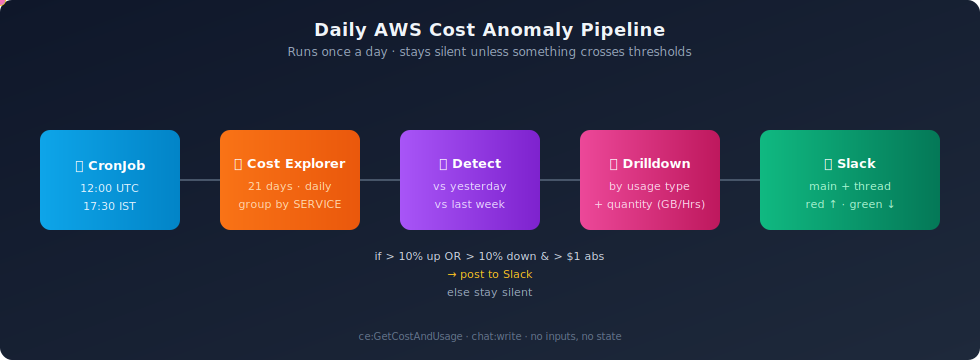

<div align="center">

# AWS Cost Anomaly Cron

**Daily AWS cost anomaly detection — straight to Slack.**

A small, opinionated Kubernetes CronJob that watches your AWS bill day by day, surfaces the services that moved meaningfully, drills down to the exact usage type responsible — and stays silent when nothing's wrong.

<br/>


<br/>



</div>

---

## ✨ Why this exists

AWS billing surprises usually arrive on the **first of next month** — by then the leak has been running for weeks. This cron flips that:

- **Yesterday's bill, this morning** — 24h lag, never more
- **Both seasonalities** — flags spikes vs the previous day **and** vs the same weekday last week, so weekend rhythms don't trigger false alarms
- **Names the culprit** — not just *"EC2-Other went up"*, but *"NAT-Gateway data transfer went from 0 GB to 47 GB"*
- **Silent unless something matters** — no daily noise post; if every service stayed within thresholds, the cron exits without messaging

## 📥 What lands in Slack

<table>
<tr>
<td valign="top" width="50%">

### Main message
- 📅 Date, day of week
- 💰 Total spend, with **both** baselines shown in dollars
- 📈 / 📉 One-line tally of services that moved
- 🎨 Colored side-bar: 🟥 if total is up, 🟩 if down, ⬜ if flat
- 🔔 Optional `@here` / `@channel` / user / usergroup mention

</td>
<td valign="top" width="50%">

### Thread reply
- 🟥 **Services that increased** — red attachments
- 🟩 **Services that decreased** — green attachments
- Each card shows the actual comparison dates **and** baseline dollars
- Below each card, bullet list of the **usage types** that drove the change with **GB / hours / requests** (not just dollars)

</td>
</tr>
</table>

## 🧠 How detection works

For each AWS service, for **yesterday (T-1)**:

| Check | Logic | Default |
|---|---|---|
| **Day-over-day** | Cost vs T-2 | flagged if up >10% **and** moved more than $1 |
| **Week-over-week** | Cost vs T-8 (same weekday) | flagged if up >10% **and** moved more than $1 |
| **Decrease** | Same logic, opposite direction | flagged if down >10% **and** moved more than $1 |
| **Noise floor** | `max(today, prev, last_week)` | services below $1 are ignored entirely |

A service appears in the report only if **at least one** check trips. If neither list has anything, the cron logs `No threshold crossings — skipping Slack post.` and exits.

## 🚀 Quick start (local)

```bash
git clone https://github.com/nammayatri/aws-cost-anomaly
cd aws-cost-anomaly

python -m venv .venv && source .venv/bin/activate
pip install -r requirements.txt

cp config.example.json config.json
# edit config.json: slack_bot_token, slack_channel_id, aws_profile

python main.py --dry-run            # print Slack payload, don't send
python main.py                      # post live
python main.py --csv ./bill.csv --date 2026-05-15 --dry-run  # backtest
```

## ⚙️ Configuration

All settings can come from **either** environment variables **or** `config.json`. Env wins. Same code path runs in dev and in-cluster.

| Key (json) | Env var | Default | Notes |
|---|---|---|---|
| `slack_bot_token` | `SLACK_BOT_TOKEN` | — | **Required.** `xoxb-…` with `chat:write` |
| `slack_channel_id` | `SLACK_CHANNEL_ID` | — | **Required.** Prefer ID over `#name` (renames don't break things) |
| `aws_profile` | `AWS_PROFILE` | — | Local only; IRSA/WI is used in-cluster |
| `aws_region` | `AWS_REGION` | `ap-south-1` | Region for the Cost Explorer client |
| `mention` | `MENTION` | empty | `here`, `channel`, a user ID (`U…`), or a usergroup ID (`S…`) |
| `increase_pct_threshold` | `INCREASE_PCT_THRESHOLD` | `10` | Up-spike threshold (percent) |
| `decrease_pct_threshold` | `DECREASE_PCT_THRESHOLD` | `10` | Down-drop threshold (percent) |
| `abs_threshold` | `ABS_THRESHOLD` | `1` | Absolute-dollar guard so pennies don't fire |
| `noise_floor` | `NOISE_FLOOR` | `1` | Skip services entirely below this |
| `lookback_days` | `LOOKBACK_DAYS` | `21` | Days of history to pull (≥ 8) |
| `top_usage_types` | `TOP_USAGE_TYPES` | `3` | How many drill-down lines per service |

## 🔐 IAM

Minimal — read-only.

```json
{
  "Version": "2012-10-17",
  "Statement": [{
    "Effect": "Allow",
    "Action": ["ce:GetCostAndUsage"],
    "Resource": "*"
  }]
}
```

Cost Explorer doesn't support resource-level ARNs, so `"Resource": "*"` is unavoidable — but the verb is read-only and only billing data leaves AWS.

> Already running a monitoring/observability service with `ce:*` access? Reuse its service account — `serviceAccountName: <yours>` and you're done.

## 🚢 Deploy

```
.
├── k8s/                 # public-friendly manifests with <PLACEHOLDERS>
└── prod/                # gitignored — your real values live here
```

### 1) Push the image

```bash
aws ecr create-repository --repository-name cost-anomaly-cron --region <REGION>

docker buildx build --platform linux/amd64 -t cost-anomaly-cron:v1 . --load
docker tag cost-anomaly-cron:v1 <ACCOUNT>.dkr.ecr.<REGION>.amazonaws.com/cost-anomaly-cron:v1

aws ecr get-login-password --region <REGION> \
  | docker login --username AWS --password-stdin <ACCOUNT>.dkr.ecr.<REGION>.amazonaws.com
docker push <ACCOUNT>.dkr.ecr.<REGION>.amazonaws.com/cost-anomaly-cron:v1
```

### 2) Fill in your real manifests

```bash
cp k8s/cronjob.yaml prod/cronjob.yaml
cp k8s/secret.yaml  prod/secret.yaml
# edit both: namespace, serviceAccountName, image, channel ID, bot token
```

### 3) Apply

```bash
kubectl apply -f prod/secret.yaml
kubectl apply -f prod/cronjob.yaml
```

### 4) Smoke-test without waiting for the schedule

```bash
kubectl -n <NS> create job --from=cronjob/cost-anomaly-cron cost-anomaly-test-1
kubectl -n <NS> logs -f job/cost-anomaly-test-1
```

Look for either a Slack post or `No threshold crossings — skipping Slack post.` in the logs.

## 🕐 When does it run?

Default: `0 12 * * *` UTC. That's chosen because AWS Cost Explorer typically finalizes the previous day's billing data by **12:00 UTC**. Earlier than that and you risk reporting on partial numbers, which causes false anomaly alerts.

## 🧪 Backtesting

Got a CSV export from AWS Cost Explorer? Aim the detector at it without touching AWS:

```bash
python main.py --csv ~/Downloads/costs.csv --date 2026-05-15 --dry-run
```

Useful for tuning thresholds against your historical noise floor before you point it at live data.

## 🛠️ Architecture

| File | Role |
|---|---|
| `main.py` | Entrypoint. Loads config, fetches, detects, drilldowns, posts. Skips post if nothing crosses. |
| `fetch.py` | Two `ce:GetCostAndUsage` calls: by `SERVICE` (broad) and per-flagged `USAGE_TYPE` (deep). Carries `UsageQuantity` + unit. |
| `detect.py` | Pure-function anomaly detection. Returns `(increases, decreases, summary)`. |
| `drilldown.py` | Per-flagged-service usage-type ranker. Both dollar and quantity deltas. |
| `slack.py` | Block Kit formatting + `chat.postMessage`. Main message + threaded breakdown. |
| `config.py` | Env-overrides-json loader. Same code path local + prod. |

## 🤝 Contributing

PRs welcome. The codebase is intentionally small and dependency-light. If you add a feature, please keep the **zero-noise-on-quiet-days** contract intact — over time it's the most important property.

## 📄 License

MIT.
